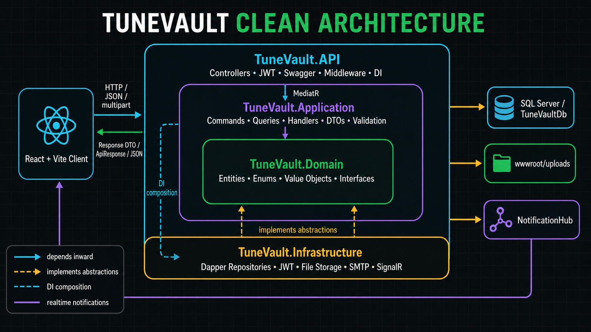
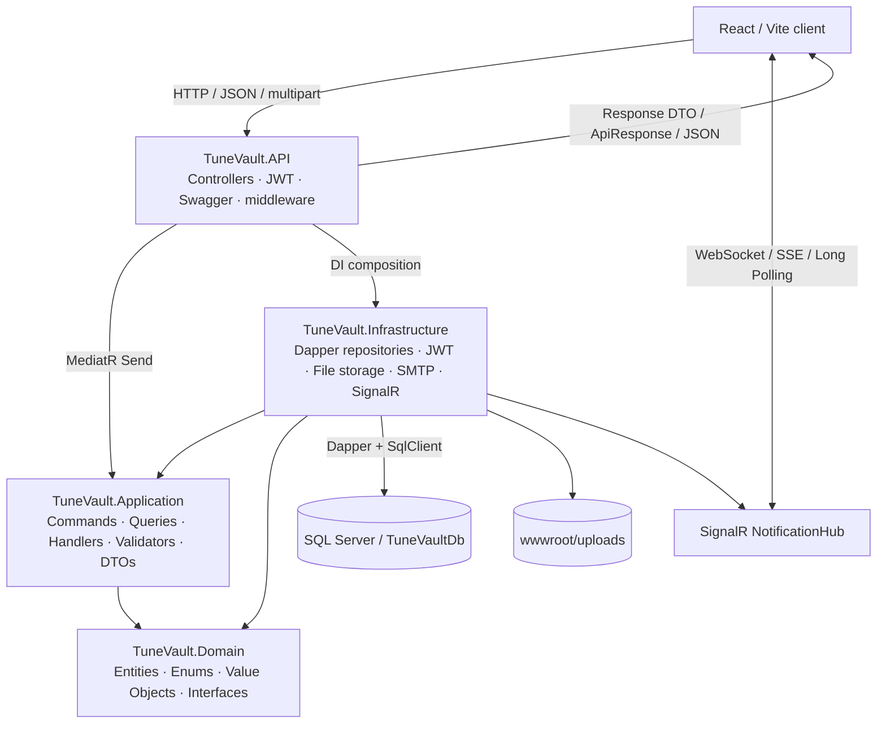
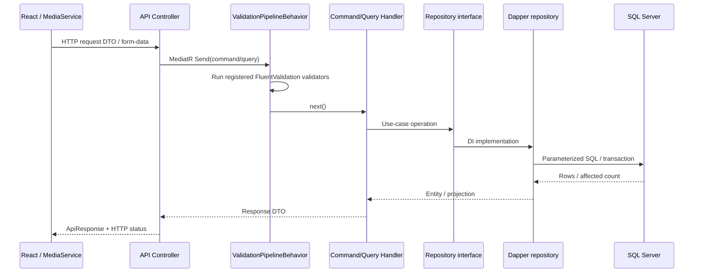

# TuneVault

TuneVault là một **media streaming web application** cho phép người dùng khám phá, phát, quản lý và chia sẻ nội dung audio, video và bài hát. Repo hiện gồm frontend React/Vite, REST API ASP.NET Core, SQL Server, xác thực JWT, pipeline CQRS với MediatR và thông báo thời gian thực bằng SignalR.

> Tài liệu này mô tả trạng thái thể hiện trong codebase hiện tại. Việc một module có controller, handler hoặc giao diện không đồng nghĩa toàn bộ luồng đã được kiểm thử end-to-end.

<a id="muc-luc"></a>
## Mục lục

- [1. Giới thiệu project](#gioi-thieu-project)
- [2. Tổng quan chức năng](#tong-quan-chuc-nang)
- [3. Công nghệ sử dụng](#cong-nghe-su-dung)
- [4. Cấu trúc thư mục và solution](#cau-truc-thu-muc)
- [5. Clean Architecture trong TuneVault](#clean-architecture)
- [6. Sơ đồ Clean Architecture](#so-do-clean-architecture)
- [7. Vì sao project dùng Dapper](#vi-sao-dung-dapper)
- [8. Application Pipeline](#application-pipeline)
- [9. Các chức năng chính](#cac-chuc-nang-chinh)
- [10. Cơ sở dữ liệu](#co-so-du-lieu)
- [Hướng dẫn chạy project](#huong-dan-chay-project)
- [12. Swagger và API](#swagger-va-api)
- [13. Dữ liệu mẫu](#du-lieu-mau)
- [14. Điểm nổi bật kỹ thuật](#diem-noi-bat-ky-thuat)
- [15. Hạn chế hiện tại và phần cần kiểm tra thêm](#han-che-hien-tai)
- [16. Hướng phát triển](#huong-phat-trien)

<a id="gioi-thieu-project"></a>
## 1. Giới thiệu project

TuneVault được tổ chức thành hai ứng dụng:

- **Frontend:** React 19 chạy bằng Vite, giao tiếp với backend qua module `frontend/Services/MediaService.tsx`.
- **Backend:** ASP.NET Core Web API trên .NET 9, dùng MediatR để chuyển request từ controller tới command/query handler.
- **Database:** Microsoft SQL Server; repository truy cập dữ liệu bằng Dapper và `Microsoft.Data.SqlClient`.
- **Authentication / Authorization:** JWT access token và refresh token, BCrypt cho mật khẩu, role `Artist`/`Listener`, policy qua `[Authorize]`.
- **Realtime:** SignalR Hub tại `/hubs/notifications`, dùng cho thông báo cá nhân.

Code hiện có module cho auth/OTP, hồ sơ người dùng, media, playlist, album, tìm kiếm, favorite, collection like, lịch sử nghe, follow, kết bạn, chia sẻ và thông báo. Mức độ đã xác nhận của từng module được ghi ở phần dưới.

<a id="tong-quan-chuc-nang"></a>
## 2. Tổng quan chức năng

| Nhóm | Dấu vết đã xác nhận trong repo | Mức độ xác nhận |
|---|---|---|
| Auth | Login, logout, register, gửi OTP, reset/change password, refresh token; JWT và BCrypt | Đã có API và handler. Frontend đã tích hợp login/register/change password/refresh; chưa thấy hàm frontend gọi reset password |
| User/Profile | Xem và cập nhật profile/avatar, lấy artist, xem user theo ID/handle | Đã có API, handler và UI `ProfileView` |
| Media | Danh sách, chi tiết, media theo artist/user, upload/update/soft delete, poster, audio/video streaming có range | Đã có API, local file storage và UI quản lý/phát media; cần kiểm thử file lớn và định dạng thực tế |
| Playlist | CRUD, public/my playlists, thêm/xóa/sắp xếp track | Đã có API, repository và UI/service tích hợp |
| Album | CRUD cho artist, public/my albums, thêm/xóa/sắp xếp track | Đã có API, repository và UI `ManageStudio` tích hợp |
| Search | Tìm media/artist/playlist và lấy trending media | Đã có API, repository và frontend gọi `searchAll`/`getTrendingTracks` |
| Favorite | Bật/tắt favorite, danh sách đã thích, trạng thái và số reaction cho media/album/playlist | Đã có API; frontend tích hợp favorite media và hiển thị reaction |
| Collection like | Like/unlike album hoặc playlist, lấy các collection like gần đây | Đã có API và frontend service/sidebar tích hợp |
| History | Ghi lượt phát, vị trí dừng, lấy lịch sử gần đây và resume | Đã có API; player frontend có gọi ghi history/stop/resume |
| Follow | Follow, unfollow, kiểm tra trạng thái follow | Đã có API và UI profile tích hợp |
| Friend | Gửi/nhận/chấp nhận/từ chối/hủy lời mời, xóa bạn, danh sách bạn bè | Đã có API và UI `FriendActivity`; gửi/chấp nhận có tạo notification realtime |
| Share | Chia sẻ media/album/playlist, inbox và sent list | Đã có API, transaction tạo share + notification và frontend tích hợp |
| Notification | Danh sách, unread, đánh dấu đã đọc, đọc tất cả, xóa | Đã có API, SignalR và UI `NotificationActivity` |

<a id="cong-nghe-su-dung"></a>
## 3. Công nghệ sử dụng

### Frontend

| Công nghệ | Vai trò được thấy trong code |
|---|---|
| React `19.2.6` / React DOM | Xây dựng giao diện |
| TypeScript và JSX | `App.tsx`, service `.tsx` và các component `.jsx` |
| Vite `8.0.12` | Dev server và build frontend |
| `@microsoft/signalr` `10.0.0` | Kết nối hub thông báo |
| CSS thuần | Style theo component/view |

### Backend

| Công nghệ | Vai trò được thấy trong code |
|---|---|
| .NET 9 / ASP.NET Core Web API | API, middleware, static files, streaming |
| MediatR `12.2.0` | Command/query và handler |
| FluentValidation `11.9.2` | Validator và `ValidationPipelineBehavior` |
| BCrypt.Net-Next `4.2.0` | Hash/verify mật khẩu |
| Swashbuckle | OpenAPI và Swagger UI |

### Database

- Microsoft SQL Server 2022 trong `docker-compose.yml`.
- Dapper `2.1.79`.
- `Microsoft.Data.SqlClient` `7.0.1`.
- SQL viết trực tiếp trong các repository và transaction thủ công ở một số luồng.

### Authentication / Authorization

- JWT Bearer với issuer, audience và symmetric secret.
- Access token 7 ngày theo cấu hình mặc định; refresh token 30 ngày theo code.
- Token được trả trong response, đồng thời backend ghi access/refresh token vào cookie `HttpOnly`.
- Role `Artist` và `Listener`; một số API album giới hạn `Artist`, API media upload cho cả hai role.
- OTP được lưu trong `OtpLogs`; `GmailSmtpEmailService` gửi qua SMTP hoặc ghi log khi bật `EmailSettings:DevMode`.

### Realtime

- ASP.NET Core SignalR.
- `NotificationHub` yêu cầu đăng nhập, đưa connection vào group theo user ID.
- Client lắng nghe sự kiện `ReceiveNotification`.

### Docker / tooling

- Docker Compose chạy SQL Server, DB init, backend và frontend.
- Multi-stage Dockerfile cho frontend: Node 20 build, Nginx phục vụ static files và reverse proxy.
- Nginx proxy `/api`, `/uploads`, `/hubs` và `/health` tới backend.

> `ANTHROPIC_API_KEY` xuất hiện trong file môi trường/Compose, nhưng chưa tìm thấy module sử dụng Anthropic trong các thư mục code đã kiểm tra; vì vậy README không coi đây là công nghệ/chức năng đã tích hợp.

<a id="cau-truc-thu-muc"></a>
## 4. Cấu trúc thư mục và solution

```text
TuneVault/
├── backend/
│   └── src/
│       ├── TuneVault.sln
│       ├── TuneVault.API/
│       │   ├── Controllers/        # REST endpoints
│       │   ├── DTOs/               # Request DTO thuộc lớp API
│       │   ├── Program.cs          # DI, JWT, CORS, Swagger, middleware, SignalR
│       │   └── wwwroot/uploads/    # File media/avatar/cover local
│       ├── TuneVault.Application/
│       │   ├── Abstractions/       # Email, storage, current user, notification pusher
│       │   ├── Common/Behaviors/   # Validation pipeline
│       │   └── Features/           # Command, query, handler, validator, DTO theo module
│       ├── TuneVault.Domain/
│       │   ├── Entities/
│       │   ├── Enums/
│       │   ├── Exceptions/
│       │   ├── Interfaces/
│       │   └── ValueObject/
│       └── TuneVault.Infrastructure/
│           ├── Authentication/
│           ├── Database/
│           ├── Persistence/
│           ├── Realtime/
│           ├── Repositories/
│           └── Services/
├── frontend/
│   ├── Services/MediaService.tsx   # API client dùng chung
│   ├── src/
│   │   ├── React/App.tsx
│   │   ├── React/Components/
│   │   └── CSS/
│   ├── package.json
│   ├── vite.config.js
│   └── nginx.conf
├── docs/
│   ├── images/
│   │   ├── clean-architecture.png
│   │   └── clean-architecture-response.png
│   ├── ERD.pdf
│   ├── PipeLine.pdf
│   └── swagger.json
├── docker-compose.yml
├── docker-compose.pro.yml
├── database.sql
├── seed.sql
└── README.md
```

Solution có bốn project: `TuneVault.Domain`, `TuneVault.Application`, `TuneVault.Infrastructure` và `TuneVault.API`.

<a id="clean-architecture"></a>
## 5. Clean Architecture trong TuneVault

### Trách nhiệm của từng layer

- **Domain:** entity (`User`, `MediaItem`, `Playlist`, `Album`, `Favorite`, `Friend`...), enum, value object, domain exception và phần lớn repository interface. Layer này không có package bên ngoài.
- **Application:** use case theo feature dưới dạng command/query/handler, DTO, validator, `ApiResponse` và các abstraction như email, file storage, current user, notification pusher. Application tham chiếu Domain.
- **Infrastructure:** triển khai Dapper repository, `DbConnectionFactory`, JWT generator, local file storage, Gmail SMTP, current-user service và SignalR pusher/hub. Infrastructure tham chiếu Application và Domain.
- **API:** controller, request DTO, dependency injection, JWT/CORS, exception handling, Swagger, static file middleware và endpoint SignalR. `Program.cs` là composition root.

### Luồng phụ thuộc

```text
Domain <- Application <- Infrastructure <- API
             ^                 |
             |--- abstraction--|
```

API hiện chỉ khai báo project reference trực tiếp tới Infrastructure; Application và Domain được nhìn thấy qua project reference bắc cầu. Tại runtime, `Program.cs` ánh xạ interface sang implementation, ví dụ `IMediaRepository` → `MediaRepository`.

### Luồng request thực tế

1. Controller nhận route/body/form-data và lấy user từ JWT.
2. Controller tạo command/query rồi gọi `ISender.Send` hoặc `IMediator.Send`.
3. `ValidationPipelineBehavior` chạy các FluentValidation validator có sẵn.
4. Handler thực thi use case qua repository/service abstraction.
5. Infrastructure repository mở `SqlConnection`, chạy SQL bằng Dapper và map kết quả.
6. Handler/controller trả DTO được bọc bằng `ApiResponse` ở phần lớn endpoint.

### Điểm chưa thuần Clean Architecture

- `TuneVault.Application` có `FrameworkReference` tới `Microsoft.AspNetCore.App`; `IFileStorageService` và `UploadMediaFormDto` dùng trực tiếp `IFormFile`. Điều này làm Application phụ thuộc abstraction của ASP.NET Core.
- Upload/update file được điều phối một phần ngay trong `MediaController` thay vì nằm hoàn toàn trong application handler.
- Repository interface chưa đặt thống nhất: phần lớn nằm trong Domain, riêng friend/notification/share command repository nằm trong Application.
- API tham chiếu trực tiếp Infrastructure rồi dùng project reference bắc cầu. Cách này chạy được cho composition root nhưng ranh giới compile-time không chặt bằng việc khai báo rõ các dependency cần dùng.

<a id="so-do-clean-architecture"></a>
## 6. Sơ đồ Clean Architecture



*Sơ đồ thể hiện request từ React vào API, response DTO/`ApiResponse` trả về client, các dependency hướng vào Domain, MediatR giữa API và Application, Infrastructure triển khai abstraction, cùng SQL Server, local uploads và SignalR NotificationHub.*



Ảnh PNG phục vụ README nằm tại [docs/images/clean-architecture-response.png](docs/images/clean-architecture-response.png). Bản ảnh ban đầu không có response vẫn nằm tại [docs/images/clean-architecture.png](docs/images/clean-architecture.png). Mermaid được giữ lại làm phiên bản có thể đọc và chỉnh sửa trực tiếp trong Markdown. Repo còn có [docs/ERD.pdf](docs/ERD.pdf) và [docs/PipeLine.pdf](docs/PipeLine.pdf).

<a id="vi-sao-dung-dapper"></a>
## 7. Vì sao project dùng Dapper

Dapper là micro-ORM cho .NET: nó mở rộng `IDbConnection` bằng các API như `QueryAsync`, `QuerySingleOrDefaultAsync` và `ExecuteAsync`, nhưng vẫn để ứng dụng chủ động viết SQL.

Trong TuneVault, Dapper xuất hiện trong toàn bộ `TuneVault.Infrastructure/Repositories`, gồm `UserRepository`, `MediaRepository`, `PlaylistRepository`, `AlbumRepository`, `FavoriteRepository`, `CollectionLikeRepository`, `PlayHistoryRepository`, `SearchRepository`, `FriendRepository`, `FollowRepository`, `MediaShareRepository`, `NotificationRepository` và `OtpLogRepository`. `DbConnectionFactory` tạo `SqlConnection` từ `DatabaseOptions:ConnectionString`.

Dapper phù hợp với code hiện tại vì:

- Nhẹ, ít lớp trừu tượng và phù hợp kiểu repository/use case đang có.
- SQL được kiểm soát trực tiếp, dễ nhìn thấy join, filter, paging và soft delete.
- Làm việc trực tiếp với SQL Server qua `Microsoft.Data.SqlClient`.
- Có thể tối ưu truy vấn theo từng màn hình như search, trending, playlist hoặc history.
- Hỗ trợ transaction rõ ràng cho các thao tác nhiều bước như share + notification và toggle reaction.

Trade-off:

- Developer phải tự viết và bảo trì SQL.
- Mapping column/entity/DTO thủ công nhiều hơn EF Core.
- Thay đổi schema dễ làm query cũ lệch nếu không cập nhật đồng bộ.
- Transaction, concurrency, nullability và rollback phải được xử lý cẩn thận trong repository.

Project hiện **không có package hoặc DbContext của Entity Framework Core**.

<a id="application-pipeline"></a>
## 8. Application Pipeline

TuneVault có CQRS ở mức command/query với MediatR và có một pipeline behavior thật:



`ValidationPipelineBehavior` chỉ chạy validator đã đăng ký. Trong code hiện tại mới thấy validator riêng cho `LoginCommand` và `ShareMediaCommand`; không nên hiểu rằng mọi command đều có FluentValidation.

### Pipeline theo chức năng

| Chức năng | Controller / use case chính | Repository, entity và side effect |
|---|---|---|
| Authentication | `AuthController` → `LoginCommand`, `RegisterCommand`, `SendOtpCommand`, `ResetPasswordCommand`, `ChangePasswordCommand` | `IUserRepository`, `IOtpLogRepository`; BCrypt verify/hash, tạo JWT, gửi OTP qua email, ghi auth cookie |
| User profile | `UsersController` → profile query/update, follow/unfollow/check | `IUserRepository`, entity `User`/`Follow`; controller lưu avatar qua `IFileStorageService` |
| Media upload/stream | `MediaController` → `UploadMediaCommand`, `UpdateMediaCommand`, `GetMediaStreamQuery` | `IMediaRepository`, entity `MediaItem`; lưu file local, rollback file mới nếu thao tác lỗi, stream audio/video có range |
| Playlist | `PlaylistController` → CRUD và command thêm/xóa/reorder track | `IPlaylistRepository`, `Playlist`, `PlaylistTrack`; kiểm tra quyền sở hữu trong use case/repository |
| Album | `AlbumsController` → CRUD và track commands | `IAlbumRepository`, `Album`, `AlbumTrack`; create/update giới hạn role `Artist` |
| Search | `SearchController` → `SearchMediaQuery`, `GetTrendingMediaQuery` | `ISearchRepository`; query media, artist và playlist rồi trả `SearchResponseDto` |
| Share | `ShareController` → `ShareMediaCommand` / inbox / sent | `MediaShareRepository`, `MediaShare`; transaction tạo share và notification, sau đó push SignalR |
| Notification | `NotificationController` → get/unread/read/read-all/delete | `NotificationRepository`, `Notification`; dữ liệu realtime được đẩy bởi `INotificationPusher` |
| Favorite | `FavoriteController` → toggle/status/list/count | `FavoriteRepository`, `Favorite`; cập nhật trạng thái reaction và số lượng theo target |
| Collection like | `CollectionLikesController` → recent/toggle | `CollectionLikeRepository`, `CollectionLike`; thêm bản ghi khi like và xóa bản ghi khi unlike |
| Play history | `HistoryController` → record/stop/recent/resume | `PlayHistoryRepository`, `PlayHistory`; lưu thứ tự nghe và số giây dừng để resume |
| Friend | `FriendsController` → request/accept/reject/cancel/remove/list | `FriendRepository`, `Friend`; gửi/chấp nhận tạo notification và push SignalR |
| Follow | `UsersController` → follow/unfollow/status | `IUserRepository` đang chứa các thao tác follow; entity `Follow` |

<a id="cac-chuc-nang-chinh"></a>
## 9. Các chức năng chính

### Auth

- Đăng nhập bằng `IdDisplay` và password.
- Đăng ký qua OTP; gửi OTP cho `register`, `reset_password`, `change_password`.
- Đổi/reset password, logout và refresh session.
- JWT access/refresh token, cookie `HttpOnly`, role-based authorization.

### User / Profile

- Xem profile cá nhân/công khai, tìm theo ID hoặc handle.
- Cập nhật display name, handle, bio và avatar.
- Danh sách artist; follow/unfollow và kiểm tra trạng thái.

### Media

- Phân loại `Audio`, `Video`, `Song` theo enum hiện tại.
- Upload, cập nhật, soft delete và lấy media public/cá nhân/theo artist.
- Local storage cho media, video, cover, canvas và avatar.
- Audio/video streaming yêu cầu JWT; poster cho phép anonymous.
- Player frontend có queue, seek, volume, resume và history.

### Playlist và Album

- CRUD collection, ảnh bìa, public/private, content type và release date.
- Thêm, xóa, đổi thứ tự track.
- Album create/update/delete dành cho artist theo controller hiện tại.

### Search

- Tìm kiếm tổng hợp media, artist và playlist.
- Lấy danh sách media trending.

### Share và Notification

- Chia sẻ media, album hoặc playlist cho user khác, kèm message.
- Inbox/sent share.
- Lưu notification và đẩy SignalR cho share/friend event.
- Đọc, đánh dấu đã đọc/đọc tất cả và xóa notification.

### Favorite / History

- Favorite media và đếm reaction cho media/album/playlist.
- Like collection album/playlist và lấy collection đã like gần đây.
- Ghi lượt phát, vị trí dừng, lịch sử gần đây và resume.

### Friend / Follow

- Hai cơ chế riêng: follow một chiều và friend request hai chiều.
- Friend request có trạng thái pending/accepted/rejected theo domain enum.

<a id="co-so-du-lieu"></a>
## 10. Cơ sở dữ liệu

Database được cấu hình là **SQL Server**, tên mặc định `TuneVaultDb`.

Các bảng được xác nhận từ SQL schema/migration hiện có:

| Nhóm | Bảng |
|---|---|
| Người dùng và quan hệ | `Users`, `Follows`, `Friends` |
| Nội dung | `MediaItems`, `Albums`, `AlbumTracks`, `Playlists`, `PlaylistTracks` |
| Tương tác | `Favorites`, `CollectionLikes`, `PlayHistory`, `MediaShares`, `Notifications` |
| Xác thực phụ trợ | `OtpLogs` |

Các domain entity tương ứng gồm `User`, `Follow`, `Friend`, `MediaItem`, `Album`, `AlbumTrack`, `Playlist`, `PlaylistTrack`, `Favorite`, `CollectionLike`, `PlayHistory`, `MediaShare` và `Notification`.

- Schema gốc và các script thay đổi nằm tại `backend/src/TuneVault.Infrastructure/Database/schemas/`.
- Docker DB init gọi `database.sql`, sau đó `seed.sql`, và bảo đảm thêm bảng `CollectionLikes` qua script init.
- ERD có tại [docs/ERD.pdf](docs/ERD.pdf). Đây là file PDF dạng hình ảnh; cần đối chiếu lại với schema mới nhất khi thay đổi database.

<a id="huong-dan-chay-project"></a>
## Hướng dẫn chạy project

### 1. Chạy local bằng lệnh

Yêu cầu:

- .NET SDK 9, vì toàn bộ project backend target `net9.0`.
- Node.js 20; khớp image `node:20-alpine` trong Dockerfile frontend.
- Docker Engine/Desktop có Docker Compose để chạy SQL Server và DB init.

Từ thư mục gốc, tạo file môi trường và thay các giá trị mẫu:

```bash 
cp .env.example .env
```

```env
SQL_SERVER_PASSWORD=your-strong-sql-server-password
JWT_SECRET=your-long-random-jwt-secret
ANTHROPIC_API_KEY=
```

#### Bước 1 — Chạy SQL Server và khởi tạo database

Service database có tên thật là `db`; `db-init` đợi database healthy, tạo `TuneVaultDb`, chạy `database.sql`, `seed.sql` và script bảo đảm `CollectionLikes`.

```bash
docker compose up -d db db-init
docker compose ps -a
docker compose logs db-init
```

`db` publish SQL Server tại `localhost:1433`. `db-init` là one-shot container nên trạng thái `Exited (0)` sau khi chạy thành công là bình thường.

#### Bước 2 — Chạy backend

File `.env` được Docker Compose đọc tự động nhưng `dotnet run` không tự đọc file này. Với Bash, nạp biến và ánh xạ chúng sang key cấu hình .NET:

```bash
set -a
source .env
set +a

export ConnectionStrings__DefaultConnection="Server=localhost,1433;Database=TuneVaultDb;User Id=sa;Password=${SQL_SERVER_PASSWORD};TrustServerCertificate=True;"
export DatabaseOptions__ConnectionString="$ConnectionStrings__DefaultConnection"
export JwtSettings__SecretKey="$JWT_SECRET"
export JwtSettings__Issuer="TuneVault_Backend_API"
export JwtSettings__Audience="TuneVault_Client_Application"
export EmailSettings__DevMode="true"

cd backend/src
dotnet restore TuneVault.sln
dotnet build TuneVault.sln
dotnet run --project TuneVault.API/TuneVault.API.csproj --launch-profile http
```

Profile `http` trong `launchSettings.json` chạy backend tại `http://localhost:5128` và mở route Swagger. Profile `https` còn khai báo `https://localhost:7263`, nhưng hướng dẫn này dùng profile `http` để khớp proxy Vite.

`EmailSettings__DevMode=true` làm OTP được ghi vào log backend thay vì gửi SMTP. Nếu cần gửi email thật, phải cấu hình đầy đủ `EmailSettings__SenderEmail`, `EmailSettings__SenderPassword`, `EmailSettings__SmtpHost` và `EmailSettings__SmtpPort`.

#### Bước 3 — Chạy frontend

Mở terminal khác tại thư mục gốc:

```bash
cd frontend
npm ci
npm run dev
```

Script `dev` và `vite.config.js` đều xác nhận frontend chạy tại `http://localhost:3000`. Vite proxy `/api`, `/uploads` và `/hubs` sang `http://localhost:5128`.

| Thành phần local | Địa chỉ |
|---|---|
| Frontend | `http://localhost:3000` |
| Backend | `http://localhost:5128` |
| Swagger | `http://localhost:5128/swagger` |
| Health check | `http://localhost:5128/health` |
| SQL Server | `localhost:1433` |

Khi không cần database local:

```bash
docker compose stop db
```

### 2. Chạy bằng Docker / Docker Compose

Repo còn hai Compose file với mục đích khác nhau:

| File | Mục đích hiện tại |
|---|---|
| `docker-compose.yml` | Cấu hình mặc định cho local/full stack; publish SQL `1433`, backend `5128`, frontend `3000` |
| `docker-compose.pro.yml` | Cấu hình hướng deploy; ASP.NET Core chạy environment `Production`, chỉ publish frontend port `80`, backend và SQL chỉ truy cập trong Docker network |

`docker-compose.local.yml` đã được xóa vì trùng hoàn toàn với `docker-compose.yml` và không có script/workflow nào tham chiếu.

#### Chạy full stack local bằng `docker-compose.yml`

```bash
cp .env.example .env
```

Sau khi thay `SQL_SERVER_PASSWORD` và `JWT_SECRET` trong `.env`:

```bash
docker compose up -d --build
docker compose ps -a
```

Theo dõi log:

```bash
docker compose logs -f backend
```

```bash
docker compose logs -f frontend
```

Các địa chỉ của stack mặc định:

- Frontend: `http://localhost:3000`
- Backend: `http://localhost:5128`
- Swagger: `http://localhost:5128/swagger`
- SQL Server: `localhost:1433`

Dừng và xóa container/network, nhưng giữ volume database:

```bash
docker compose down
```

Chỉ dùng tùy chọn `-v` khi chấp nhận xóa toàn bộ dữ liệu SQL local:

```bash
docker compose down -v
```

#### Chạy cấu hình hướng deploy

Phải dừng stack mặc định trước vì hai file dùng cùng `container_name`:

```bash
docker compose down
docker compose -f docker-compose.pro.yml up -d --build
docker compose -f docker-compose.pro.yml ps -a
docker compose -f docker-compose.pro.yml logs -f backend
```

Frontend được publish tại `http://localhost` (host port `80`). Backend port `8080` và SQL Server port `1433` chỉ tồn tại trong Docker network, không được publish ra host bởi file này.

```bash
docker compose -f docker-compose.pro.yml down
```

`docker-compose.pro.yml` mới là cấu hình **hướng deploy**, chưa có TLS, secret manager, backup hoặc health check cho backend/frontend; cần bổ sung các phần này trước khi xem là cấu hình production hoàn chỉnh.

#### Dockerfile và build context

- `backend/src/TuneVault.API/Dockerfile`: build/publish API bằng .NET SDK 9, chạy bằng ASP.NET Runtime 9.
- `frontend/Dockerfile`: build React/Vite bằng Node 20, sau đó phục vụ bằng Nginx.
- `frontend/nginx.conf`: phục vụ SPA và proxy `/api`, `/uploads`, `/hubs`, `/health` tới service `backend:8080`.
- `backend/src/.dockerignore` và `frontend/.dockerignore`: loại `bin`/`obj` hoặc `node_modules`/`dist` khỏi đúng build context.

> Các biến `EMAIL_*` trong `.env.example` hiện chưa được hai Compose file ánh xạ sang `EmailSettings__*`; cần kiểm tra/cấu hình thêm trước khi test OTP qua Docker.

<a id="swagger-va-api"></a>
## 12. Swagger và API

`Program.cs` bật Swagger và Swagger UI không phụ thuộc environment:

- Swagger UI: `http://localhost:5128/swagger`
- OpenAPI JSON khi backend chạy: `http://localhost:5128/swagger/v1/swagger.json`
- Snapshot trong repo: [docs/swagger.json](docs/swagger.json)

Controller hiện dùng các route gốc:

```text
/api/auth
/api/users
/api/media
/api/playlists
/api/albums
/api/search
/api/favorites
/api/collection-likes
/api/history
/api/friends
/api/shares
/api/notifications
```

README không sao chép toàn bộ endpoint để tránh lệch với controller. Dùng Swagger runtime hoặc `docs/swagger.json` để xem method, request schema và response; snapshot cần được xuất lại sau khi API thay đổi.

<a id="du-lieu-mau"></a>
## 13. Dữ liệu mẫu

`seed.sql` xác nhận 7 tài khoản và ghi rõ BCrypt hash khớp với password bên dưới:

| Vai trò | IdDisplay | Password |
|---|---|---|
| Listener | `listener_one` | `listener_one123` |
| Listener | `listener_two` | `listener_two123` |
| Artist | `sontungmtp` | `sontungmtp123` |
| Artist | `justinbieber` | `justinbieber123` |
| Artist | `shakira` | `shakira123` |
| Artist | `mono` | `mono123` |
| Artist | `soobin` | `soobin123` |

Script cũng `MERGE` 12 bản ghi `MediaItems` (`M001`–`M012`) và trỏ asset tới các đường dẫn dưới `/uploads`.

Các tài khoản này chỉ dành cho local/demo. Việc đăng nhập thành công còn phụ thuộc database đã chạy seed đúng và asset local tồn tại.

<a id="diem-noi-bat-ky-thuat"></a>
## 14. Điểm nổi bật kỹ thuật

- Solution bốn layer theo hướng Clean Architecture, có ghi rõ các điểm coupling hiện tại.
- CQRS bằng MediatR và validation pipeline bằng FluentValidation.
- Dapper repository với SQL rõ ràng và transaction cho use case nhiều bước.
- JWT access/refresh token, role authorization, BCrypt và OTP.
- Upload local và streaming audio/video có range processing.
- SignalR notification theo group user.
- Docker Compose cho database, init/seed, API và frontend.
- Swagger/OpenAPI và health endpoint.

<a id="han-che-hien-tai"></a>
## 15. Hạn chế hiện tại và phần cần kiểm tra thêm

- Chưa chạy bộ kiểm thử end-to-end trong phạm vi cập nhật README; mức “đã tích hợp” ở trên dựa trên luồng gọi trong code.
- Chưa tìm thấy test project tự động trong `TuneVault.sln`.
- Backend có `reset-password`, nhưng chưa thấy hàm gọi tương ứng trong `MediaService.tsx`/`AuthLoginModal`.
- Chỉ `LoginCommand` và `ShareMediaCommand` có FluentValidation validator riêng được tìm thấy; các use case khác cần đánh giá validation theo từng handler/entity/controller.
- `Application` còn phụ thuộc ASP.NET Core qua `IFormFile`; upload orchestration còn nằm trong controller.
- `docs/swagger.json`, `docs/ERD.pdf` và `docs/PipeLine.pdf` là snapshot/tài liệu tĩnh; cần kiểm tra lại sau mỗi thay đổi API/schema.
- Cấu hình `EMAIL_*` trong `.env.example` chưa được Compose map sang `EmailSettings__*`; luồng OTP Docker cần cấu hình thêm.
- Cần kiểm thử thêm upload 500 MB, range streaming, cleanup file khi update/delete và quyền truy cập media private.
- Có cả `frontend/src/React/App.jsx` và `App.tsx`; `main.jsx` đang import `App.tsx`. File JSX có thể là bản cũ và cần quyết định giữ/xóa trong công việc khác.
- `ANTHROPIC_API_KEY` có trong cấu hình nhưng chưa tìm thấy code sử dụng.
- Cấu hình nhạy cảm không nên lưu giá trị thật trong file được commit; cần rà soát secret, chuyển sang user secrets/biến môi trường và rotate nếu từng lộ.
- `AGENTS.md`, `CURRENT_STATUS.md`, `API_CONTRACT.md` và `Untitled.sql`: chưa tìm thấy trong codebase hiện tại.

<a id="huong-phat-trien"></a>
## 16. Hướng phát triển

- Bổ sung unit/integration test cho handler, repository và authorization.
- Hoàn thiện UI reset password và kiểm thử đầy đủ auth/OTP/refresh.
- Tách `IFormFile` khỏi Application bằng model stream/file abstraction độc lập framework.
- Chuẩn hóa vị trí repository interface và dependency giữa các project.
- Tự động hóa migration/schema version thay vì phụ thuộc snapshot SQL.
- Thêm kiểm thử streaming, upload, transaction và SignalR reconnect.
- Đồng bộ Swagger/ERD/pipeline trong CI khi contract hoặc schema thay đổi.
